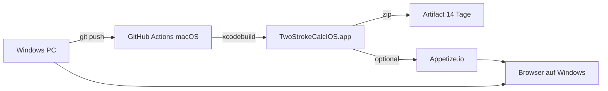

# iOS testen ohne Mac und ohne iPhone

Du brauchst **keinen eigenen Mac** und **kein physisches iPhone**, um die iOS-App zu bauen und interaktiv zu testen. Der Mac läuft in der GitHub-Cloud; die Bedienung erfolgt im **Browser**.

## Empfohlene Lösung: GitHub Actions + Appetize.io



| Schritt | Wo | Kosten |
|---------|-----|--------|
| Build (Gradle + Xcode) | GitHub `macos-latest` | Public Repo: kostenlos |
| Simulator-.app | CI-Artefakt | inklusive |
| Im Browser bedienen | [Appetize.io](https://appetize.io) | Free: 5 Apps, ~15 Min/Tag Streaming |

### Einmal einrichten (≈ 10 Minuten)

1. **Appetize-Konto:** https://appetize.io/signup  
2. **API Token:** Dashboard → Account → API Token  
3. **GitHub konfigurieren** (Repo → Settings → Secrets and variables → Actions):
   - **Secret:** `APPETIZE_API_TOKEN` = dein Token  
   - **Variable:** `APPETIZE_ENABLED` = `true`  
   - **Variable (optional):** `APPETIZE_PUBLIC_KEY` = Public Key einer bestehenden App (sonst legt CI bei jedem Lauf eine neue an)

4. **Push** auf `main` oder `iOS/Android-compatibility` → Workflow [`.github/workflows/calc-build.yml`](../.github/workflows/calc-build.yml) startet.

5. **Link öffnen:** https://appetize.io/app/DEIN_PUBLIC_KEY (oder im Actions-Job-Summary unter „Appetize (Live)“)

6. **Manuell triggern:** GitHub → Actions → „Calc Build“ → **Run workflow**.

### Was du im Browser testen kannst

- Splash, Onboarding, alle Tabs (Rechner, Fahrzeuge, Einstellungen)
- UI-Navigation, Formulare, Walkthrough
- Firebase/Auth/StoreKit nur eingeschränkt (kein echter App Store, Google Sign-In im Simulator oft limitiert)

### Was du lokal auf Windows testen kannst (ohne iOS)

Business-Logik und Rechner liegen in `shared/`:

```powershell
./gradlew :shared:testAndroidHostTest
./gradlew :androidApp:assembleDebug
```

Das deckt **KMP-Logik** ab, nicht SwiftUI-Layouts.

---

## Alternative: Nur CI-Build (ohne Browser)

Ohne Appetize liefert jeder grüne Workflow-Lauf ein **Artefakt** `TwoStrokeCalcIOS-simulator.zip`.  
Du kannst es herunterladen, aber **auf Windows nicht starten** – Simulator-.apps laufen nur unter macOS/iOS-Simulator oder in Diensten wie Appetize.

---

## Andere Optionen (Kurz)

| Option | Mac nötig? | iPhone nötig? | Hands-on im Browser |
|--------|------------|---------------|---------------------|
| **Appetize.io** | nein (CI baut) | nein | ja |
| **BrowserStack App Live** | nein (CI baut) | nein | ja (kostenpflichtig) |
| **GitHub Actions + Artefakt** | nein | nein | nein (nur Build-Nachweis) |
| **Mac-VM lokal** | ja (virtuell) | nein | nein (Simulator in VM) |
| **xtool auf WSL** | nein | oft ja (USB) | nein |
| **Eigener Mac + Simulator** | ja | nein | nein |

---

## Häufige Probleme

**Workflow rot – Xcode/Firebase:** Log in Actions prüfen; oft fehlende SPM-Auflösung oder Kotlin-Framework-Pfad. Lokal `:shared:compileAndroidMain` auf Windows sollte grün sein.

**Appetize startet nicht:** Nur **Simulator-Builds** (`.app`), keine `.ipa`. Unser CI baut mit `-sdk iphonesimulator` und `CODE_SIGNING_ALLOWED=NO`.

**Free-Limit Appetize:** Link bookmarken; gleiche App mit `APPETIZE_PUBLIC_KEY` updaten statt neue App pro Build.

---

## Kurzfassung

> **Push → GitHub baut auf macOS → Appetize-Link → iPhone-Simulator im Chrome/Edge auf Windows.**

Kein Mac auf deinem Schreibtisch, kein iPhone in der Hand – für UI-Exploration reicht das in der Regel aus.
